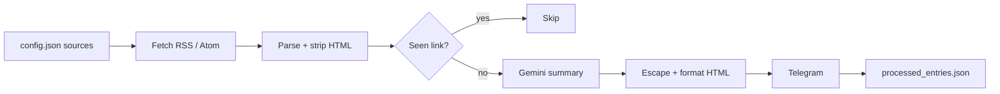

# Newsletter Triage

Hourly digest of industry newsletters, delivered as short Telegram briefs.

A cron-ready Python job that pulls RSS/Atom feeds, skips already-seen items, summarizes new ones with Gemini, and posts niche-tagged takeaways to Telegram. **Python 3 standard library only — no `pip install`.**

`Python 3` · `stdlib HTTP/XML` · `Gemini API` · `Telegram Bot API` · `cron`

## Problem

Newsletter volume is high; signal is not. This job replaces inbox skimming with a capped, deduped brief: one new item per source per run, focused on practical takeaways for a configured niche (AI, JavaScript, Python, CSS).

## Pipeline




## Design choices

These are the parts a reviewer should look at in [`main.py`](main.py).

| Decision | Why it matters |
|---|---|
| **Stdlib only** | `urllib`, `xml.etree`, `json`, `re`. No `requests` / `feedparser` lock-in; easy to drop on a VPS or cron host. |
| **RSS 2.0 and Atom** | Real feeds are mixed. Parser looks up `item` and namespaced `entry`, including Atom `link href`. |
| **308 redirect follow** | `urlopen` handles 301/302; several newsletter hosts return 308. Relative `Location` is resolved against the original origin. |
| **Idempotent reruns** | Seen URLs live in `processed_entries.json`, written after each successful Telegram send. A failed send is left unprocessed and retried next hour. |
| **Per-source cap** | `max_entries_per_run` bounds Gemini spend and Telegram noise. Default in config is 1. |
| **429 backoff** | Gemini calls retry with exponential delay (`5s`, `7s`, `11s`) plus a 5s pause between items. HTTP calls use a 20s timeout. |
| **Explicit dry-run** | `--dry-run` scrapes without side effects. Missing secrets without that flag fail the job. |
| **API key as header** | Gemini auth uses `x-goog-api-key`, not a query string, so keys are less likely to land in logs. |
| **Telegram-safe HTML** | Title and model output are escaped, then `**bold**` and list markers are converted. Avoids broken `parse_mode` from raw model markdown. |
| **Secrets stay out of git** | `.env` and the processed-id store are gitignored. [`.env.example`](.env.example) documents the contract. |

## Setup

```bash
git clone <this-repo>
cd NewsletterTriage
cp .env.example .env
```

Fill in `.env`:

| Variable | Purpose |
|---|---|
| `TELEGRAM_BOT_TOKEN` | Bot from [@BotFather](https://t.me/BotFather) |
| `TELEGRAM_CHAT_ID` | Destination chat (user, group, or channel the bot can post to) |
| `GEMINI_API_KEY` | [Google AI Studio](https://aistudio.google.com/apikey) |

Confirm feeds without spending tokens:

```bash
python3 main.py --dry-run
```

Live run (requires all three env vars):

```bash
python3 main.py
```

## Configuration

Sources and budget live in [`config.json`](config.json), not in code:

```json
{
  "sources": [
    { "name": "JavaScript Weekly", "url": "https://javascriptweekly.com/rss/", "niche": "JavaScript" }
  ],
  "settings": {
    "max_entries_per_run": 1,
    "summary_length": "medium"
  }
}
```

`niche` and `summary_length` (`short` / `medium` / `long`) are injected into the Gemini prompt. Add or remove feeds by editing the array.

## Operations

Hourly cron (adjust the working directory):

```cron
0 * * * * cd /path/to/NewsletterTriage && /usr/bin/python3 main.py >> triage.log 2>&1
```

State file: `processed_entries.json` (created on the first successful live run). Delete it to reprocess history. Logs are stdout/stderr only — redirect as above.

## Tests

Stdlib `unittest` only — CI does not install packages.

```bash
python3 -m unittest discover -s tests -v
```

GitHub Actions runs that command on every push and pull request ([`.github/workflows/ci.yml`](.github/workflows/ci.yml)). Tests stay offline: RSS/Atom fixtures, mocked 308/429 HTTP, failed sends that must not persist, and `--dry-run`.

## Layout

```
NewsletterTriage/
├── main.py                 # fetch → parse → summarize → send
├── config.json             # feeds + per-run cap
├── tests/                  # unittest, no third-party deps
├── .github/workflows/ci.yml
├── .env.example            # required secrets
├── processed_entries.json  # local idempotency store (not committed)
└── README.md
```

Single module, explicit I/O, no framework. The interesting code is the HTTP edge cases, the dry-run split, and the retry/dedupe path — not the file count.
